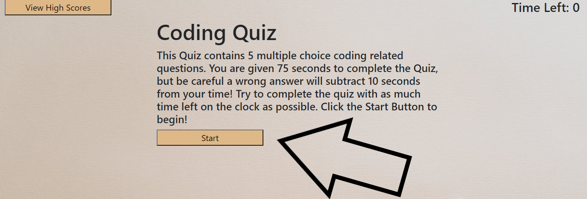
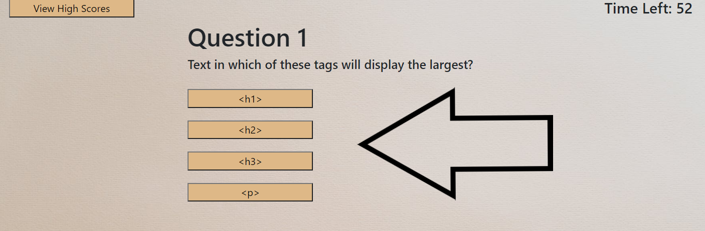
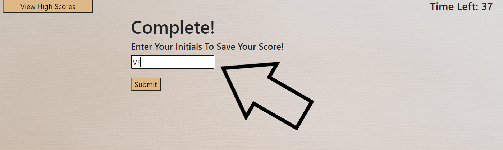

# Coding-Quiz

## Timed Quiz with Code Related Questions

### Overview:
In this repository I created a timed code related quiz.  The quiz consists of 5 questions that will ask basic code questions.  The quiz gives you 75 seconds to answer all five questions and then saves your score when you complete it. This was primarily accomplished using Javascript web API's to manipulate DOM Elements.  

## How it works!

### The process goes Like this:
### Click The Start Button

### Answer The Questions

### Submit Your Initials

### View Your High Scores

### Example
Here is a link to the Quiz:  [https://vfavorito.github.io/Coding-Quiz/](https://vfavorito.github.io/Coding-Quiz/)

### Installation
To install this project simply clone this repository to your local directory and access it using Visual Studio Code

### License
Copyright <2020> < Vincent Favorito >

Permission is hereby granted, free of charge, to any person obtaining a copy of this software and associated documentation files (the "Software"), to deal in the Software without restriction, including without limitation the rights to use, copy, modify, merge, publish, distribute, sublicense, and/or sell copies of the Software, and to permit persons to whom the Software is furnished to do so, subject to the following conditions:

The above copyright notice and this permission notice shall be included in all copies or substantial portions of the Software.

THE SOFTWARE IS PROVIDED "AS IS", WITHOUT WARRANTY OF ANY KIND, EXPRESS OR IMPLIED, INCLUDING BUT NOT LIMITED TO THE WARRANTIES OF MERCHANTABILITY, FITNESS FOR A PARTICULAR PURPOSE AND NONINFRINGEMENT. IN NO EVENT SHALL THE AUTHORS OR COPYRIGHT HOLDERS BE LIABLE FOR ANY CLAIM, DAMAGES OR OTHER LIABILITY, WHETHER IN AN ACTION OF CONTRACT, TORT OR OTHERWISE, ARISING FROM, OUT OF OR IN CONNECTION WITH THE SOFTWARE OR THE USE OR OTHER DEALINGS IN THE SOFTWARE.